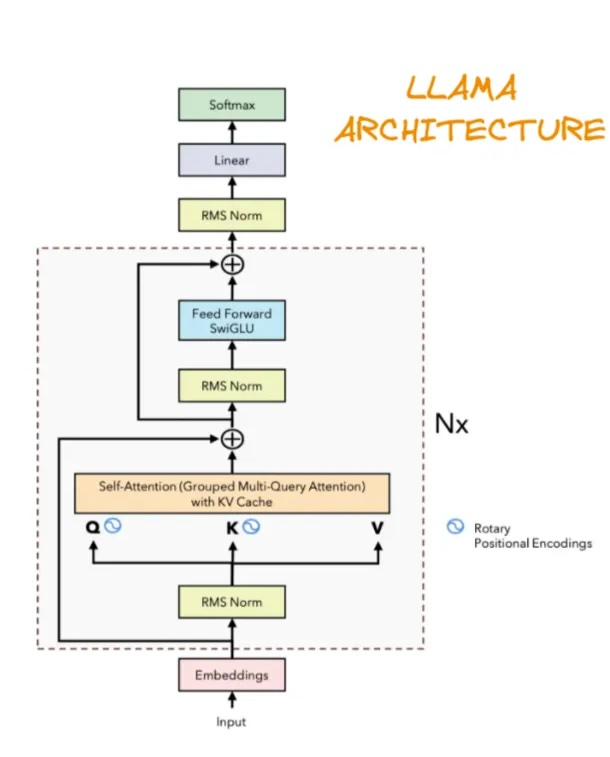

# SmolLM2 Text Generation Demo

This is a simple text generation demo using the SmolLM2 language model with a Gradio interface.

## Description

This application provides a web interface for text generation using the SmolLM2 language model. Users can input a prompt and adjust various generation parameters to control the output.

## Features

- Interactive web interface built with Gradio
- Adjustable generation parameters:
  - Maximum new tokens (1-150)
  - Temperature (0.1-2.0)
  - Top-K sampling (1-100)
- Real-time text generation

## Usage

1. Enter your prompt in the text input field
2. Adjust the generation parameters (optional):
   - **Max New Tokens**: Controls the length of the generated text
   - **Temperature**: Controls randomness (higher = more creative, lower = more focused)
   - **Top-K**: Controls diversity of word choices
3. Click submit to generate text

## Installation

1. Clone the repository
2. Install dependencies:
   ```bash
   pip install -r requirements.txt
   ```
 ## Run the application:
   ```bash
   python app.py
   ```
   The interface will be available at `http://localhost:7860`


## Train the model:
```bash
python train.py
```


# Model details
SmolLM2 is a language model designed for [add your model's specific details here]. The model uses the [specify tokenizer] tokenizer from Hugging Face's transformers library.

## Llama 2 Architecture


Read https://pub.towardsai.net/llama-explained-a70e71e706e9 for more details.

# Compare Custom SmolLM2-135 with HuggingFaceTB/SmolLM2-135M
 HuggingFaceTB/SmolLM2-135M
```bash
LlamaForCausalLM(
  (model): LlamaModel(
    (embed_tokens): Embedding(49152, 576)
    (layers): ModuleList(
      (0-29): 30 x LlamaDecoderLayer(
        (self_attn): LlamaAttention(
          (q_proj): Linear(in_features=576, out_features=576, bias=False)
          (k_proj): Linear(in_features=576, out_features=192, bias=False)
          (v_proj): Linear(in_features=576, out_features=192, bias=False)
          (o_proj): Linear(in_features=576, out_features=576, bias=False)
        )
        (mlp): LlamaMLP(
          (gate_proj): Linear(in_features=576, out_features=1536, bias=False)
          (up_proj): Linear(in_features=576, out_features=1536, bias=False)
          (down_proj): Linear(in_features=1536, out_features=576, bias=False)
          (act_fn): SiLU()
        )
        (input_layernorm): LlamaRMSNorm((576,), eps=1e-05)
        (post_attention_layernorm): LlamaRMSNorm((576,), eps=1e-05)
      )
    )
    (norm): LlamaRMSNorm((576,), eps=1e-05)
    (rotary_emb): LlamaRotaryEmbedding()
  )
  (lm_head): Linear(in_features=576, out_features=49152, bias=False)
)
```

Custom SmolLM2-135
```bash 
SmolLM2(
  (embedding): Embedding(49152, 576)
  (layers): ModuleList(
    (0-29): 30 x LlamaBlock(
      (attention): LlamaAttention(
        (q_proj): Linear(in_features=576, out_features=576, bias=False)
        (k_proj): Linear(in_features=576, out_features=192, bias=False)
        (v_proj): Linear(in_features=576, out_features=192, bias=False)
        (o_proj): Linear(in_features=576, out_features=576, bias=False)
      )
      (feed_forward): LlamaFFN(
        (gate): Linear(in_features=576, out_features=1536, bias=False)
        (up): Linear(in_features=576, out_features=1536, bias=False)
        (down): Linear(in_features=1536, out_features=576, bias=False)
        (act_fn): SiLU()
      )
      (attention_norm): RMSNorm((576,), eps=1e-05, elementwise_affine=True)
      (ffn_norm): RMSNorm((576,), eps=1e-05, elementwise_affine=True)
    )
  )
  (norm): RMSNorm((576,), eps=1e-05, elementwise_affine=True)
  (lm_head): Linear(in_features=576, out_features=49152, bias=False)
)

```

# Training Logs
## Training with 5000 steps (without checkpoint)
```bash
(venv) gitesh.grover@Giteshs-MacBook-Pro ai-era-assignment13 % python train.py


Resolving data files: 100%|████████████████████████████████████████████████████████████████████████████████████████████████████████████████████████████████████████████████████████| 104/104 [00:00<00:00, 720.56it/s]
Resolving data files: 100%|█████████████████████████████████████████████████████████████████████████████████████████████████████████████████████████████████████████████████████| 104/104 [00:00<00:00, 562123.22it/s]
Epoch: 0, Step: 0, Batch: 0, Loss: 10.9101, Time: 1.44s, Token/s: 2842.75
Saved checkpoint at step 0
What is Gravity? thymopenedi something aneur checklist fertiliserlete hiding Watching [[GuardinnamonGuard thym thym something multilinguali runway astronlighten runwayinnamon nastylighten disadvant snout plumquest
Epoch: 0, Step: 1, Batch: 1, Loss: 10.6729, Time: 2.00s, Token/s: 2044.98
Epoch: 0, Step: 2, Batch: 2, Loss: 9.2034, Time: 1.16s, Token/s: 3517.56
Epoch: 0, Step: 3, Batch: 3, Loss: 8.5723, Time: 1.09s, Token/s: 3766.14
Epoch: 0, Step: 4, Batch: 4, Loss: 8.1478, Time: 1.07s, Token/s: 3845.85
:
:
Epoch: 0, Step: 500, Batch: 500, Loss: 5.9723, Time: 1.07s, Token/s: 3825.45
Saved checkpoint at step 500
What is Gravity? We call us to use, I can create a `e` function to do to add a few to calculate their lives.
* An the need
Epoch: 0, Step: 501, Batch: 501, Loss: 6.0491, Time: 1.58s, Token/s: 2595.98
:
:
Epoch: 0, Step: 998, Batch: 998, Loss: 5.8647, Time: 1.25s, Token/s: 3289.61
Epoch: 0, Step: 999, Batch: 999, Loss: 6.0096, Time: 1.10s, Token/s: 3726.16
Epoch: 0, Step: 1000, Batch: 1000, Loss: 6.4388, Time: 1.09s, Token/s: 3763.74
Saved checkpoint at step 1000
What is Gravity? These tales of sharing a beautiful blend of the art, where will understand these questions where remain.

III. **4.g., the Individuals
:
:
Epoch: 0, Step: 1498, Batch: 1498, Loss: 7.3296, Time: 1.06s, Token/s: 3878.60
Epoch: 0, Step: 1499, Batch: 1499, Loss: 6.0611, Time: 1.06s, Token/s: 3864.26
Epoch: 0, Step: 1500, Batch: 1500, Loss: 6.1140, Time: 1.08s, Token/s: 3789.80
Saved checkpoint at step 1500
What is Gravity?

Now imagine don't forget, "It have been the game?" But there are just as an 'L', does not can he noticed,

:
:
:
:

Epoch: 0, Step: 3498, Batch: 3498, Loss: 5.7145, Time: 1.07s, Token/s: 3830.33
Epoch: 0, Step: 3499, Batch: 3499, Loss: 5.7578, Time: 1.09s, Token/s: 3767.61
Epoch: 0, Step: 3500, Batch: 3500, Loss: 6.0798, Time: 1.07s, Token/s: 3811.98
Saved checkpoint at step 3500
What is Gravity? Let's how a "P"? You might need to play and a new environment that makes it up a big planet of the whole piece of the information
Epoch: 0, Step: 3501, Batch: 3501, Loss: 5.8375, Time: 1.47s, Token/s: 2790.70
Epoch: 0, Step: 3502, Batch: 3502, Loss: 6.3435, Time: 1.07s, Token/s: 3838.95
Epoch: 0, Step: 3503, Batch: 3503, Loss: 5.8192, Time: 1.05s, Token/s: 3901.14

:
:
Epoch: 0, Step: 4496, Batch: 4496, Loss: 5.5488, Time: 1.06s, Token/s: 3862.06
Epoch: 0, Step: 4497, Batch: 4497, Loss: 5.8281, Time: 1.07s, Token/s: 3821.71
Epoch: 0, Step: 4498, Batch: 4498, Loss: 5.5703, Time: 1.07s, Token/s: 3844.92
Epoch: 0, Step: 4499, Batch: 4499, Loss: 6.0630, Time: 1.06s, Token/s: 3854.04
Epoch: 0, Step: 4500, Batch: 4500, Loss: 5.5889, Time: 1.06s, Token/s: 3860.19
Saved checkpoint at step 4500
What is Gravity?

V. **Additional 2: Prepare a Power

* **I and the Eaught of Life

Before our exploration, understanding
:
:
Epoch: 0, Step: 4996, Batch: 4996, Loss: 6.1501, Time: 1.06s, Token/s: 3865.19
Epoch: 0, Step: 4997, Batch: 4997, Loss: 5.9107, Time: 1.05s, Token/s: 3884.67
Epoch: 0, Step: 4998, Batch: 4998, Loss: 5.7005, Time: 1.07s, Token/s: 3834.26
Epoch: 0, Step: 4999, Batch: 4999, Loss: 5.8820, Time: 1.07s, Token/s: 3814.07
Saved final checkpoint
What is Gravity? You would be a better big way, there are people have just like!

As they saw out to the world in the world or making a
Training complete

```

## Training with Additional 50 steps (with checkpoint)
### Note that the model was saved at 4999 step and resumed from 5000 step
```bash
Loading checkpoint from checkpoints/checkpoint_final.pt
Resuming from epoch 0 at step 5000 with loss 5.881985664367676
Resolving data files: 100%|████████████████████████████████████████████████████████████████████████████████████████████████████████████████████████████████████████████████████████| 104/104 [00:00<00:00, 313.79it/s]
Resolving data files: 100%|█████████████████████████████████████████████████████████████████████████████████████████████████████████████████████████████████████████████████████| 104/104 [00:00<00:00, 462574.35it/s]
Epoch: 0, Step: 5000, Batch: 0, Loss: 5.6473, Time: 2.69s, Token/s: 1520.90
Saved checkpoint at step 5000
What is Gravity? Well, remember, there's where those who do something as part of art and animals, family around us. For instance, there's like! But
Epoch: 0, Step: 5001, Batch: 1, Loss: 6.1124, Time: 1.54s, Token/s: 2660.36
Epoch: 0, Step: 5002, Batch: 2, Loss: 5.8381, Time: 1.11s, Token/s: 3680.22
:
:
Epoch: 0, Step: 5044, Batch: 44, Loss: 6.1118, Time: 1.09s, Token/s: 3749.53
Epoch: 0, Step: 5045, Batch: 45, Loss: 5.8618, Time: 1.11s, Token/s: 3676.88
Epoch: 0, Step: 5046, Batch: 46, Loss: 5.8893, Time: 1.08s, Token/s: 3784.70
Epoch: 0, Step: 5047, Batch: 47, Loss: 5.7507, Time: 1.10s, Token/s: 3729.83
Epoch: 0, Step: 5048, Batch: 48, Loss: 5.6882, Time: 1.10s, Token/s: 3715.38
Epoch: 0, Step: 5049, Batch: 49, Loss: 5.7396, Time: 1.09s, Token/s: 3745.38
Saved final checkpoint
What is Gravity? Have you would be wondering what life, you don't just how to do? She needed, they have had to know that "but these things has
Training complete

```
